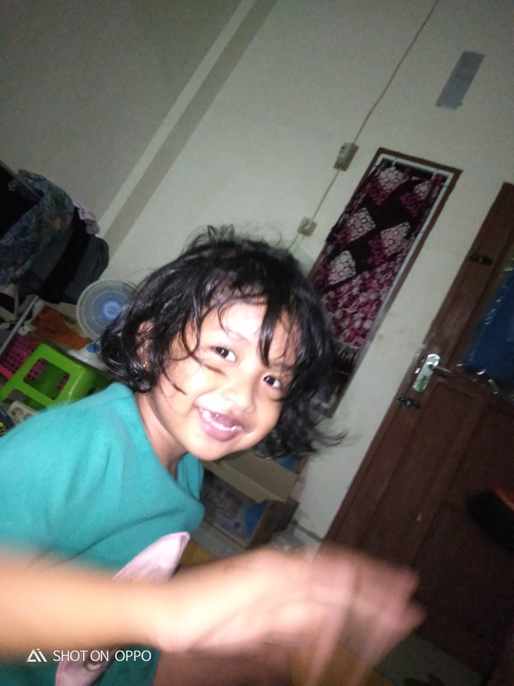

# Analisi HTML
## link
```html
<link rel="stylesheet" href="https://cdnjs.cloudflare.com/ajax/libs/font-awesome/6.5.0/css/all.min.css">
```
- Menyediakan akses ke ikon siap pakai (phone, email, LinkedIn, GitHub, dll).
- Membuat tampilan lebih modern karena tidak hanya teks biasa.

## menu navigasi
```html
<nav>
  <ul>
    <li><a href="porto.html">Home</a></li>
    <li>
      <a href="about.html">About ▾</a>
      <ul class="dropdown">
        <li><a href="#">Profile</a></li>
        <li><a href="#">Experience</a></li>
        <li><a href="#">Education</a></li>
      </ul>
    </li>
    <li><a href="projects.html">Projects</a></li>
    <li><a href="gallery.html">Gallery </a></li>
    <li><a href="contact.html">Contact</a></li>
  </ul>
</nav>
```
- Memberikan navigasi cepat ke halaman lain (Home, About, Projects, Gallery, Contact).
- Ada fitur dropdown menu pada "About" untuk menampilkan submenu.

## ikon kontak
```html
<i class="fas fa-phone" style="color:#25d366; font-size:18px; margin-right:8px;"></i> 
<a href="tel:+628123456789">+628123456789</a>
```
- Memberi ikon telepon agar pengguna langsung tahu fungsinya.
- Style inline dipakai untuk memberi warna hijau (WhatsApp style) & ukuran ikon.

## gallery
```html
<section>
  <h1>Galeri Foto</h1>
  <div class="gallery">
    
    ...
    
  </div>
</section>
```
Menyediakan tampilan galeri foto.

- Elemen *<*div class="gallery"*>* biasanya diatur di style.css  kemungkinan berupa grid atau flex agar gambar tampil rapi.

- alt="Foto x"  berguna untuk aksesibilitas & SEO (teks alternatif saat gambar gagal dimuat).
# Analisis CSS
## Body
```css
body {
  margin: 0;                      /* Reset margin default browser */
  font-family: Arial, sans-serif; /* Gunakan font Arial, fallback sans-serif */
  background: #CADCAE;            /* Warna latar belakang hijau pucat */
  color: #000000;                 /* Warna teks hitam agar kontras */
}
```
body{} artinya selector menargetkan elemen <body> di HTML, yaitu wadah utama dari seluruh isi halaman web.
``
``
## Container
```css
.container {
  display: grid;                          /* Ubah layout jadi grid */
  grid-template-columns: 300px 1fr;       /* Kolom kiri 300px (sidebar), kanan fleksibel */
  max-width: 1000px;                      /* Lebar maksimal container */
  margin: 20px auto;                      /* Posisikan di tengah dengan margin vertikal 20px */
  background: #BBDCE5;                    /* Warna latar biru muda */
  box-shadow: 0 2px 8px rgba(0,0,0,0.1);  /* Efek bayangan lembut */
  border-radius: 12px;                    /* Sudut elemen dibuat melengkung */
}
```
Ada titik (.) di depannya → ini menargetkan class. Jadi CSS ini berlaku untuk semua elemen yang punya class="container".
``
``
## sidebar
```css
.sidebar {
  background: #4A9782;     /* Warna hijau tua */
  padding: 20px;           /* Jarak isi ke tepi */
  text-align: center;      /* Isi di rata tengah */
}
```
.sidebar{} artinya selector menargetkan semua elemen HTML yang memiliki atribut class="sidebar".
``
``
## sidebar image
```css
.sidebar img {
  width: 120px;            /* Lebar gambar profil */
  height: 120px;           /* Tinggi gambar profil */
  border-radius: 50%;      /* Gambar dibulatkan (lingkaran) */
  object-fit: cover;       /* Isi gambar dipotong agar pas */
  margin-bottom: 15px;     /* Jarak bawah 15px dengan elemen lain */
}
```
.sidebar img{} artinya selector menargetkan semua elemen HTML yang memiliki atribut class="sidebar".
``
``
## navigasi
```css
nav {
  background: #4A9782;     /* Warna hijau tua */
  padding: 10px;           /* Jarak dalam navigasi */
  text-align: center;      /* Isi link rata tengah */
  position: sticky;        /* Navigasi menempel saat scroll */
  top: 0;                  /* Menempel di bagian atas viewport */
}

nav a {
  color: white;            /* Warna teks link putih */
  text-decoration: none;   /* Hilangkan garis bawah default */
  margin: 0 15px;          /* Jarak antar link */
}
```
nav{} Selector ini menargetkan elemen *<*nav*>* yang berada di dalam elemen HTML
``
``
## dropdown menu
```css
nav ul li ul.dropdown {
  display: none;             /* Sembunyikan submenu secara default */
  position: absolute;        /* Posisi submenu mengambang */
  top: 100%;                 /* Tampil tepat di bawah menu induk */
  background-color: #4a9782; /* Warna sama dengan navbar */
}

nav ul li:hover ul.dropdown {
  display: block;            /* Tampilkan submenu saat menu induk di-hover */
}
```
Selector nav ul li.dropdown{} menargetkan semua elemen HTML yang memiliki class="dropdown" pada tag *<*nav*>*
``
``
## gallery
```css
.gallery {
  display: grid;                                               /* Gunakan grid layout */
  grid-template-columns: repeat(auto-fit, minmax(200px, 1fr)); /* Grid fleksibel: kolom min 200px, sisanya isi otomatis */
  gap: 15px;                                                   /* Jarak antar gambar */
  margin-top: 20px;                                            /* Jarak atas dari elemen sebelumnya */
}

.gallery img {
  width: 100%;                                    /* Gambar isi penuh grid */
  border-radius: 8px;                             /* Sudut gambar dibulatkan */
  transition: transform 0.3s;                     /* Animasi saat transform */
}

.gallery img:hover {
  transform: scale(1.05);                         /* Gambar membesar saat hover */
}
```
Selector .gallery{} menargetkan semua elemen di halaman HTML yang memiliki class="gallery"
``
``
## Footer
```css
footer {
  background: #A2B38B;           /* Warna hijau pastel */
  color: #fff;                   /* Warna teks putih */
  border-radius: 0 0 10px 10px;  /* Hanya sudut bawah dibulatkan */
}
```
Selector footer{} menargetkan elemen HTML *<*footer*>*.


